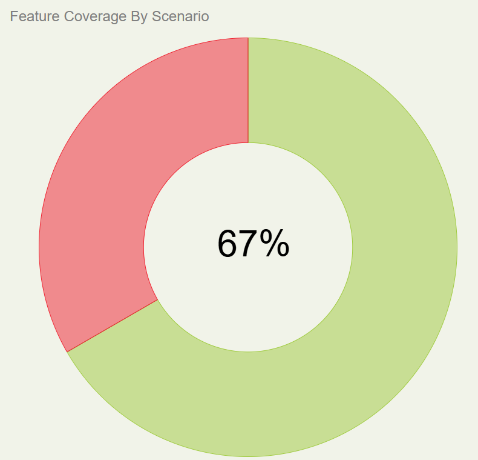
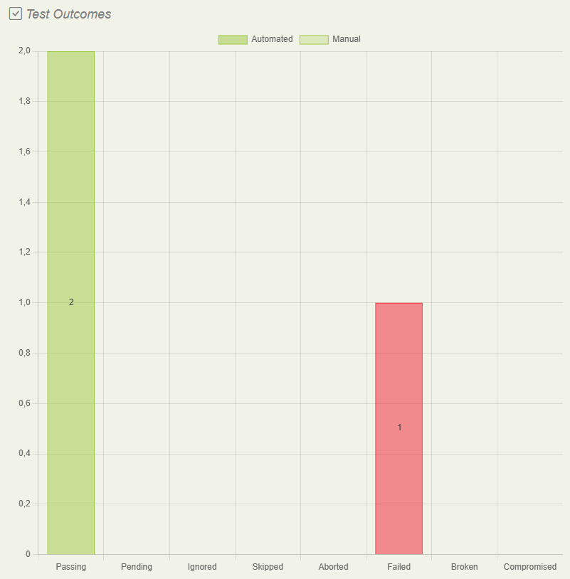
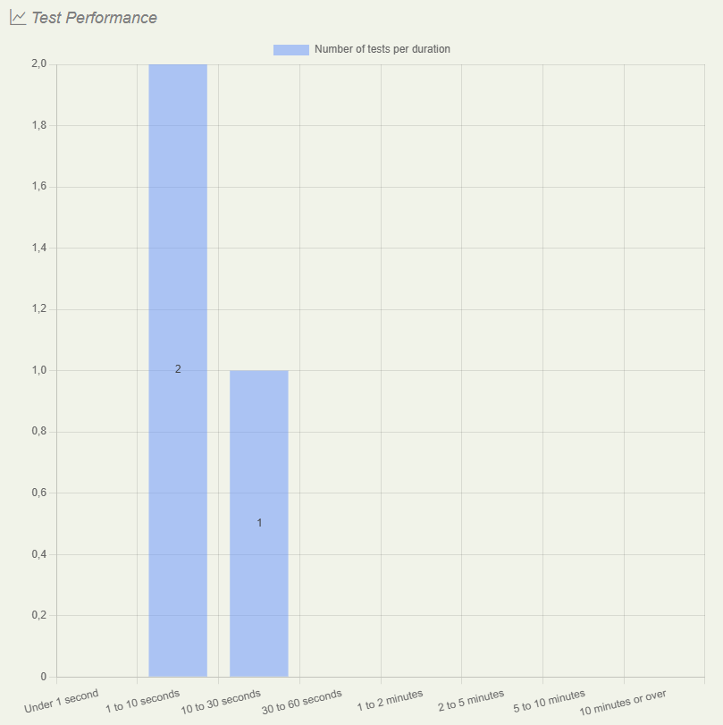
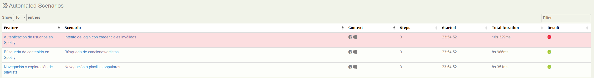

# Spotify Web - Automated Testing Project

## 📋 Descripción
Proyecto de automatización de pruebas funcionales sobre Spotify Web utilizando Java, Serenity BDD, Selenium WebDriver y Cucumber con patrón Screenplay.

---

## 🔧 Dependencias necesarias

- **JDK 17**
- **Maven 3.9.9+**

**Verificar instalación:**
```bash
java -version
mvn -version
```

---

## 🚀 Instalación y ejecución

### 1. Clonar el repositorio
```bash
git clone https://github.com/jangellopezing/prueba-qa-automatizador-castor.git
cd prueba-qa-automatizador-castor
```

### 2. Instalar dependencias
```bash
mvn clean install -DskipTests
```

### 3. Ejecutar las pruebas
```bash
mvn clean verify
```

---

## 📊 Generación de reporte

### Generar reportes
Los reportes se generan automáticamente después de ejecutar `mvn clean verify`.

### Abrir el reporte
```bash
# El reporte se encuentra en:
target/site/serenity/index.html
```

**Abrir en navegador:**
- Navegar a `target/site/serenity/` y abrir `index.html`

---

## 🧪 Escenarios automatizados

1. **Login con credenciales inválidas**
2. **Búsqueda de canciones/artistas** ("Coldplay")
3. **Navegación a playlists populares** (Top Listas)

---

## 📈 Cómo interpretar el reporte de resultados

### Vista General del Reporte

El reporte de Serenity se encuentra en `target/site/serenity/index.html` y presenta las siguientes secciones clave:

#### 1. **Feature Coverage (Cobertura de Funcionalidades)**
- **Gráfico circular** que muestra el porcentaje de escenarios ejecutados
- **67%** indica la cobertura actual de los casos de prueba
- Colores:
    - 🟢 Verde: Test Cases que pasaron
    - 🔴 Rojo: Test Cases que fallaron



#### 2. **Test Outcomes (Resultados de Pruebas)**
Muestra el resumen de ejecución:
- **Passing**: Número de pruebas exitosas
- **Failed**: Número de pruebas fallidas

**Ejemplo de lectura:**
- 2 pruebas pasaron exitosamente ✅
- 1 prueba falló ❌
- 0 pruebas pendientes



#### 3. **Test Performance (Rendimiento)**
- Gráfico de barras con el tiempo de ejecución por prueba
- Identifica pruebas lentas que necesitan optimización
- **Duración Total**: 16s
- **Prueba más rápida**: 8s
- **Prueba más lenta**: 16s



#### 4. **Key Statistics (Estadísticas Clave)**
Información detallada sobre la ejecución:

| Métrica | Descripción | Ejemplo |
|---------|-------------|---------|
| **Number of Scenarios** | Total de escenarios ejecutados | 3 |
| **Total Test Cases** | Casos de prueba totales | 3 |
| **Tests Started** | Hora de inicio | Nov 15, 2025 23:54:52 |
| **Tests Finished** | Hora de finalización | Nov 15, 2025 23:55:09 |
| **Total Duration** | Tiempo total de ejecución | 16s |
| **Average Execution Time** | Tiempo promedio por prueba | 11s |

#### 5. **Automated Tests (Detalle de Pruebas)**
Tabla detallada con cada escenario:

**Columnas:**
- **Feature**: Funcionalidad probada
- **Scenario**: Escenario específico
- **Steps**: Número de pasos ejecutados
- **Started**: Hora de inicio
- **Total Duration**: Duración del test
- **Result**: Estado final (🟢 Success / 🔴 Failed)



### Navegación en el Reporte

1. **Click en un escenario** → Ver detalles paso a paso con screenshots
2. **Click en "Failed"** → Ver el error específico y stack trace
3. **Pestaña "Requirements"** → Ver cobertura por features
4. **Pestaña "Test Results"** → Ver todos los resultados organizados

### Análisis de Resultados

- ✅ **Pruebas exitosas**: El comportamiento esperado funciona correctamente
- ❌ **Pruebas fallidas**: Requieren análisis inmediato
    - Verificar locators
    - Revisar cambios en la UI
    - Validar precondiciones
    - Analizar el stack trace en el reporte

**Ejemplo de análisis de fallo:**
Si "Login con credenciales inválidas" falla, revisar si:
1. El mensaje de error está siendo mostrado correctamente
2. Los locators del mensaje de error son correctos
3. El timeout es suficiente para que aparezca el elemento
4. Ver screenshot del momento del fallo en el reporte

---

## 🌐 Evidencia del reporte en línea (CI/CD)

El proyecto utiliza **GitHub Actions** para la ejecución automática de las pruebas.

📊 **Reporte actualizado:** [https://jangellopezing.github.io/prueba-qa-automatizador-castor/](https://jangellopezing.github.io/prueba-qa-automatizador-castor/)

El reporte se genera y se publica automáticamente en GitHub Pages después de cada ejecución del pipeline.

---

## 👤 Autor
**Jose Angel Lopez - QA Automation**  
jangel.lopez.ing@gmail.com